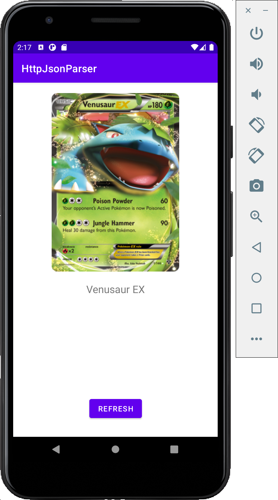
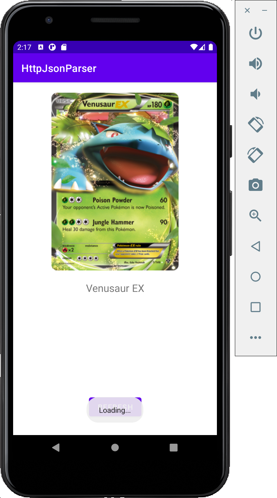
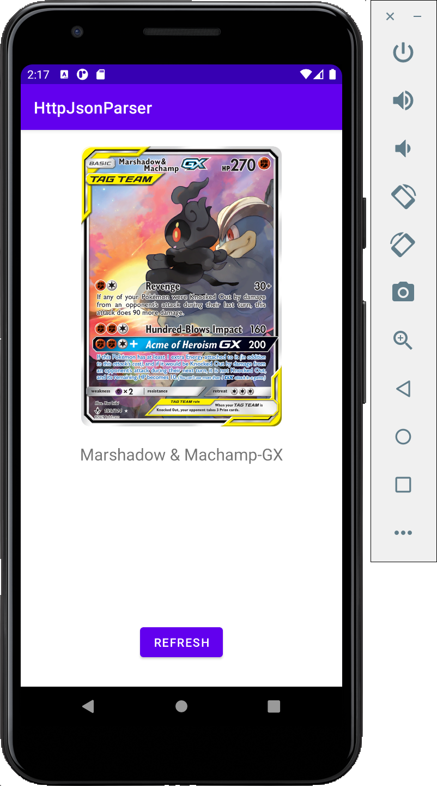

# HttpJsonParser by Ryan A Lee
- Simple Android App that selects a random Pokémon card from [https://pokemontcg.io](https://pokemontcg.io)
- Currently only displays name of the card and a picture

## Extra Credit
n/a

## Screenshots

